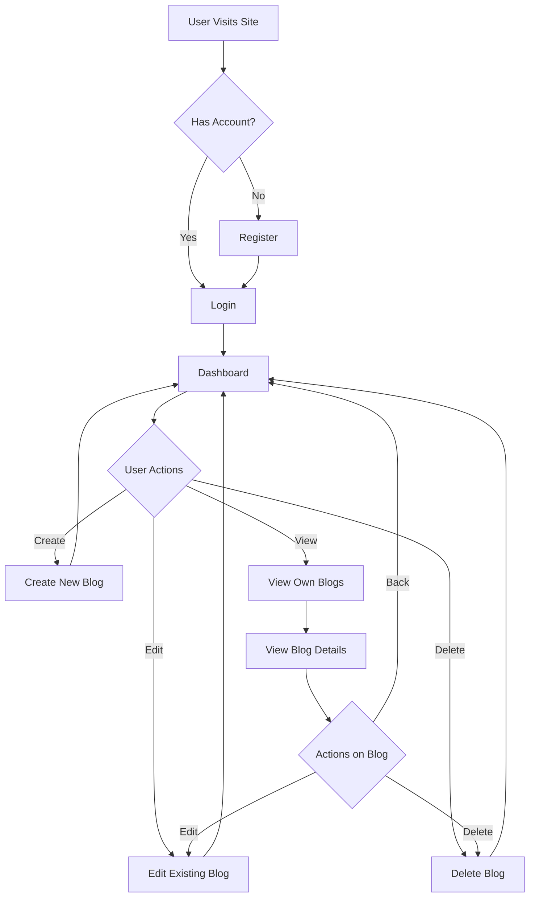
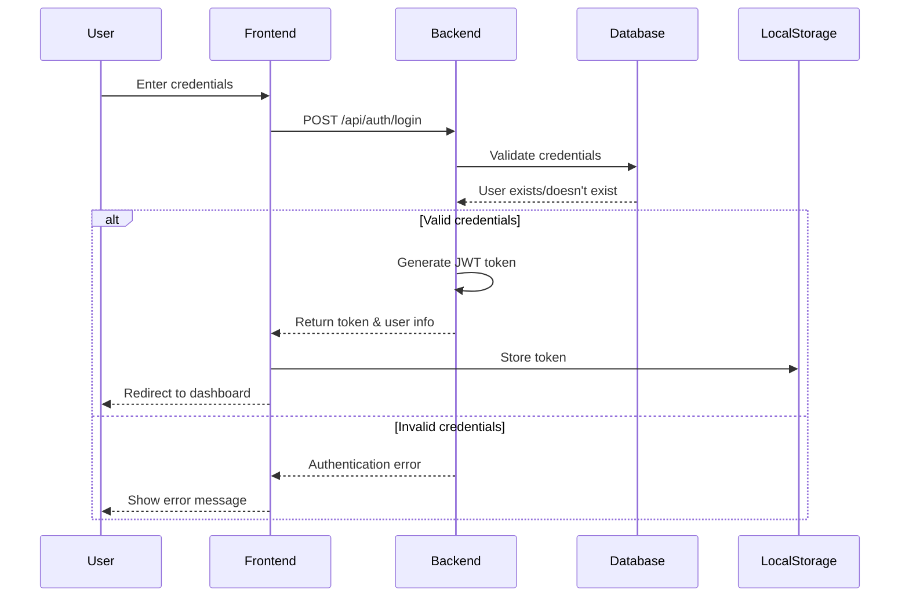
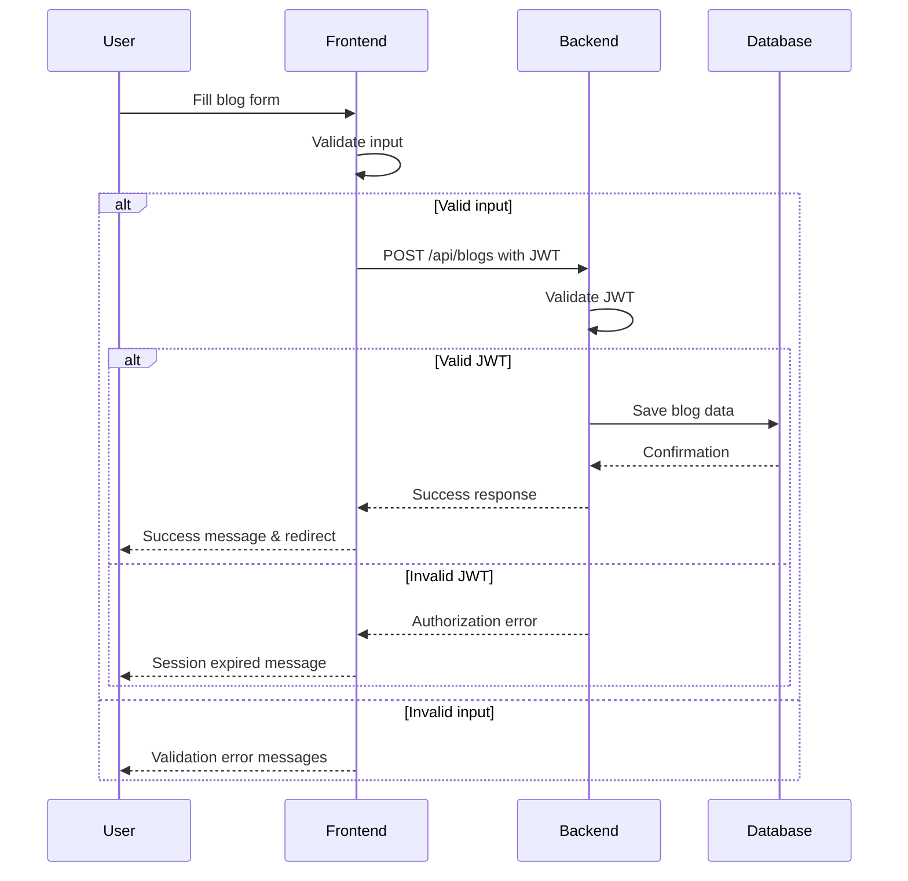
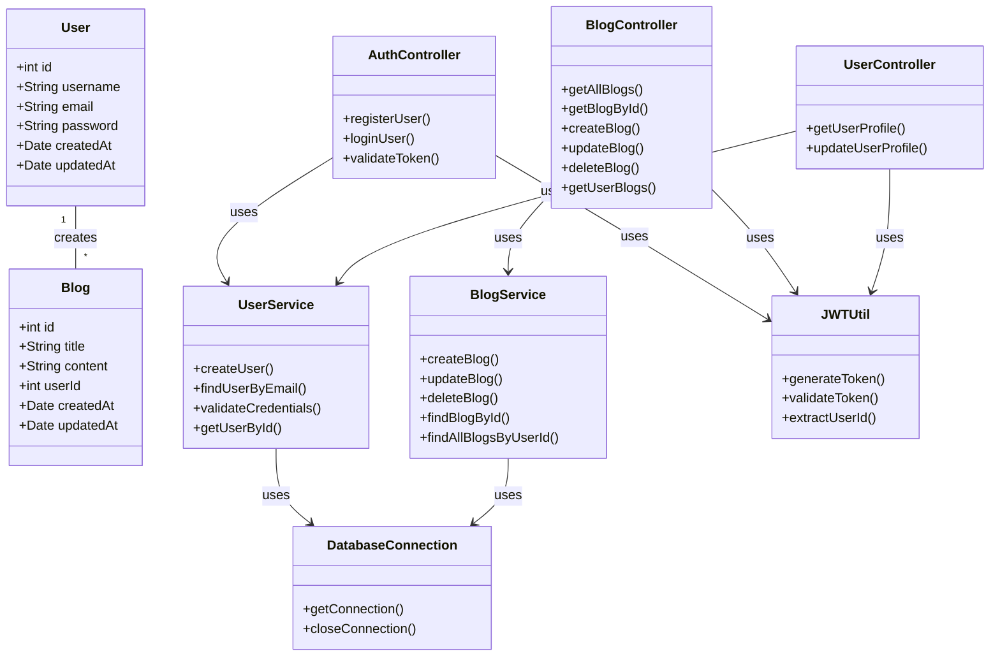
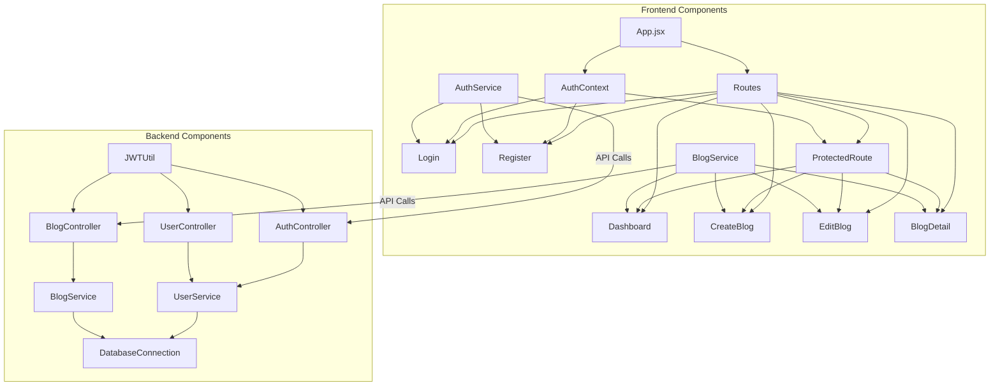
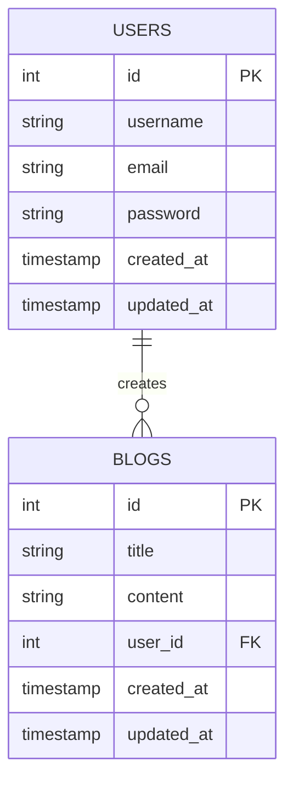

# Bloggyfy - Modern Blogging Platform

## Project Documentation for College Presentation and Viva

**Live Deployments:**
- Netlify: https://iaadarsh-blogging-platform.windsurf.build
- Vercel: https://blogyfy-u6um34m6r-adarsh-tripathis-projects.vercel.app

## Project Structure Layout

```
blogging-platform/
├── .github/                        # GitHub configuration files
├── database/                       # MySQL database scripts
│   └── schema.sql                  # Database schema definition
├── src/
│   ├── main/
│   │   ├── java/                   # Java backend code
│   │   │   └── com/blog/
│   │   │       ├── controllers/    # API controllers
│   │   │       │   ├── AuthController.java
│   │   │       │   ├── BlogController.java
│   │   │       │   └── UserController.java
│   │   │       ├── filters/        # Servlet filters (CORS, Auth)
│   │   │       │   ├── CORSFilter.java
│   │   │       │   └── AuthFilter.java
│   │   │       ├── models/         # Data models
│   │   │       │   ├── Blog.java
│   │   │       │   └── User.java
│   │   │       ├── services/       # Business logic
│   │   │       │   ├── BlogService.java
│   │   │       │   └── UserService.java
│   │   │       └── utils/          # Utility classes
│   │   │           ├── DatabaseConnection.java
│   │   │           └── JWTUtil.java
│   │   └── webapp/                 # Web application resources
│   │       ├── WEB-INF/           # Servlet configuration
│   │       │   └── web.xml        # Web application configuration
│   │       └── static/            # Frontend application
│   │           ├── public/        # Static files
│   │           │   ├── index.html # HTML entry point
│   │           │   └── favicon.ico
│   │           ├── src/           # React source code
│   │           │   ├── assets/    # Static assets (images, etc.)
│   │           │   ├── components/# Reusable React components
│   │           │   │   ├── Navbar.jsx
│   │           │   │   └── ProtectedRoute.jsx
│   │           │   ├── context/   # React context (state management)
│   │           │   │   └── AuthContext.jsx
│   │           │   ├── pages/     # Page components
│   │           │   │   ├── BlogDetail.jsx
│   │           │   │   ├── CreateBlog.jsx
│   │           │   │   ├── Dashboard.jsx
│   │           │   │   ├── EditBlog.jsx
│   │           │   │   ├── Login.jsx
│   │           │   │   └── Register.jsx
│   │           │   ├── services/  # API services
│   │           │   │   ├── authService.js
│   │           │   │   └── blogService.js
│   │           │   ├── styles/    # CSS styling
│   │           │   │   ├── main.css
│   │           │   │   └── enhanced-theme.css
│   │           │   ├── App.jsx    # Main app component
│   │           │   ├── App.css    # App-specific styling
│   │           │   ├── config.js  # Configuration constants
│   │           │   ├── index.css  # Global styling
│   │           │   └── main.jsx   # Application entry point
│   │           ├── .gitignore     # Git ignore file
│   │           ├── package.json   # NPM dependencies
│   │           ├── vite.config.js # Vite configuration
│   │           └── vercel.json    # Vercel deployment config
│   └── test/                      # Test directory
├── db-setup.bat                   # Database setup script
├── run-app-updated.bat            # Application startup script
├── README.md                      # Project documentation
├── DOCUMENTATION.md              # Detailed technical documentation
└── pom.xml                        # Maven configuration
```

## 1. Project Overview

Bloggyfy is a full-stack blogging platform that enables users to create, read, update, and delete blog posts. The application features modern UI with gradient themes, interactive animations, and a responsive design that works across all devices.

### Core Features

- **User Authentication**: Secure registration and login system
- **Blog Management**: Create, edit, and delete blog posts
- **Dashboard Interface**: User-friendly dashboard to manage personal blogs
- **Responsive Design**: Optimized for mobile, tablet, and desktop devices
- **Modern UI/UX**: Stylish interface with animations and visual feedback

## 2. Technology Stack

### Frontend Technologies

- **React.js**: Frontend library for building the user interface
- **Vite**: Next-generation frontend tooling for faster development and optimized builds
- **React Router**: For client-side routing and navigation between pages
- **Framer Motion**: For smooth animations and transitions
- **CSS3 with Custom Properties**: For theming and styling
- **Axios**: For making HTTP requests to the backend API

### Backend Technologies

- **Java Servlets**: Core server-side technology for handling HTTP requests
- **Java**: Primary programming language for the backend
- **JDBC**: For database connectivity
- **MySQL**: Relational database for storing user data and blog content
- **Tomcat**: Servlet container for running the Java application

### DevOps & Deployment

- **Git**: Version control system for tracking changes
- **Netlify**: Cloud hosting platform for frontend deployment
- **Vercel**: Alternative deployment platform for frontend
- **Maven**: Build automation tool for the Java backend

## 3. Architecture Overview

Bloggyfy uses a modern client-server architecture:

```
┌───────────────────┐     ┌─────────────────────┐     ┌────────────────┐
│                   │     │                     │     │                │
│  React Frontend   │────▶│  Java Servlet API   │────▶│  MySQL Database│
│  (Vite Build)     │◀────│  (Tomcat Server)    │◀────│                │
│                   │     │                     │     │                │
└───────────────────┘     └─────────────────────┘     └────────────────┘
```

### 3.1 Frontend Architecture

The React frontend follows a component-based architecture:

- **Context API**: For state management (AuthContext)
- **Hooks**: For component logic and state
- **Protected Routes**: For securing authenticated pages
- **Service Layer**: For API communication

### 3.2 Backend Architecture

The Java backend follows the MVC (Model-View-Controller) pattern:

- **Models**: Represent data structures (User, Blog)
- **Controllers**: Servlet controllers for handling requests
- **Services**: Business logic layer
- **Data Access**: Database interaction layer

## 4. Project Structure Explained

```
blogging-platform/
├── src/
│   ├── main/
│   │   ├── java/
│   │   │   └── com/blog/
│   │   │       ├── controllers/  # Servlet controllers for API endpoints
│   │   │       │   ├── AuthController.java
│   │   │       │   ├── BlogController.java
│   │   │       │   └── UserController.java
│   │   │       ├── models/       # Data models and entities
│   │   │       │   ├── Blog.java
│   │   │       │   └── User.java
│   │   │       ├── services/     # Business logic
│   │   │       │   ├── AuthService.java
│   │   │       │   ├── BlogService.java
│   │   │       │   └── UserService.java
│   │   │       └── utils/        # Utility classes
│   │   │           ├── DatabaseConnection.java
│   │   │           └── JWTUtil.java
│   │   └── webapp/
│   │       ├── WEB-INF/          # Servlet configuration
│   │       │   └── web.xml       # Web application configuration
│   │       └── static/           # Frontend React application
│   │           ├── src/
│   │           │   ├── components/   # Reusable UI components
│   │           │   │   ├── Navbar.jsx
│   │           │   │   └── ProtectedRoute.jsx
│   │           │   ├── context/      # React Context API
│   │           │   │   └── AuthContext.jsx
│   │           │   ├── pages/        # Page components
│   │           │   │   ├── Dashboard.jsx
│   │           │   │   ├── Login.jsx
│   │           │   │   ├── Register.jsx
│   │           │   │   ├── CreateBlog.jsx
│   │           │   │   ├── EditBlog.jsx
│   │           │   │   └── BlogDetail.jsx
│   │           │   ├── services/     # API service layer
│   │           │   │   ├── blogService.js
│   │           │   │   └── mockService.js
│   │           │   ├── styles/       # CSS styling
│   │           │   │   ├── main.css
│   │           │   │   ├── enhanced-theme.css
│   │           │   │   └── dashboard.css
│   │           │   ├── assets/       # Static assets
│   │           │   │   └── images/
│   │           │   │       ├── pattern.svg
│   │           │   │       ├── wave-bg.svg
│   │           │   │       └── dots.svg
│   │           │   ├── App.jsx       # Main application component
│   │           │   └── main.jsx      # Entry point
│   │           ├── package.json      # NPM dependencies
│   │           ├── vite.config.js    # Vite configuration
│   │           ├── netlify.toml      # Netlify deployment config
│   │           └── vercel.json       # Vercel deployment config
└── pom.xml                           # Maven dependencies and build config
```

## 5. Key Components Deep Dive

### 5.1 Frontend Components

#### Authentication System
- **AuthContext.jsx**: Provides global state for user authentication
- **Login.jsx/Register.jsx**: User authentication forms
- **ProtectedRoute.jsx**: HOC for securing routes based on authentication status

#### Blog Management
- **Dashboard.jsx**: Main user interface for viewing and managing blogs
- **CreateBlog.jsx**: Form for creating new blog posts
- **EditBlog.jsx**: Modification of existing blog posts
- **BlogDetail.jsx**: View for reading a complete blog post

#### UI Enhancement
- **Navbar.jsx**: Navigation component with responsive design
- **enhanced-theme.css**: Advanced styling with gradients, animations, and effects
- **main.css**: Core styling with CSS variables for theming

### 5.2 Backend Components

#### API Controllers
- **AuthController**: Handles user registration, login, and authentication
- **BlogController**: Manages CRUD operations for blog posts
- **UserController**: Manages user profile data

#### Service Layer
- **AuthService**: Authentication business logic and JWT generation
- **BlogService**: Blog content management logic
- **UserService**: User data management logic

#### Data Access
- **DatabaseConnection**: Manages database connectivity
- **Repository Classes**: Handle data persistence and retrieval

## 6. Database Schema

### User Table
```sql
CREATE TABLE users (
    id INT PRIMARY KEY AUTO_INCREMENT,
    username VARCHAR(50) NOT NULL UNIQUE,
    email VARCHAR(100) NOT NULL UNIQUE,
    password VARCHAR(255) NOT NULL,
    created_at TIMESTAMP DEFAULT CURRENT_TIMESTAMP,
    updated_at TIMESTAMP DEFAULT CURRENT_TIMESTAMP ON UPDATE CURRENT_TIMESTAMP
);
```

### Blog Table
```sql
CREATE TABLE blogs (
    id INT PRIMARY KEY AUTO_INCREMENT,
    title VARCHAR(255) NOT NULL,
    content TEXT NOT NULL,
    user_id INT NOT NULL,
    created_at TIMESTAMP DEFAULT CURRENT_TIMESTAMP,
    updated_at TIMESTAMP DEFAULT CURRENT_TIMESTAMP ON UPDATE CURRENT_TIMESTAMP,
    FOREIGN KEY (user_id) REFERENCES users(id) ON DELETE CASCADE
);
```

## 7. API Endpoints

### Authentication API
- **POST /api/auth/register**: Register a new user
- **POST /api/auth/login**: Authenticate and receive JWT token
- **GET /api/auth/user**: Get current user info

### Blog API
- **GET /api/blogs**: List all blog posts
- **GET /api/blogs/{id}**: Get specific blog post
- **POST /api/blogs**: Create new blog post
- **PUT /api/blogs/{id}**: Update existing blog post
- **DELETE /api/blogs/{id}**: Delete blog post

### User API
- **GET /api/users/{id}**: Get user profile
- **PUT /api/users/{id}**: Update user profile

## 8. Authentication Flow

1. **Registration**:
   - User enters details on registration form
   - Frontend validates input
   - POST request to /api/auth/register
   - Backend creates new user record with hashed password
   - JWT token issued and stored in localStorage

2. **Login**:
   - User enters credentials
   - POST request to /api/auth/login
   - Backend validates credentials
   - JWT token issued and stored in localStorage

3. **Protected Routes**:
   - On accessing protected route, ProtectedRoute component checks for valid token
   - If token exists, user can access the route
   - If no token, user redirected to login page

4. **Automatic Authentication**:
   - On application load, AuthContext checks for token in localStorage
   - If token exists, user is automatically authenticated
   - If token expired, user redirected to login

## 9. Data Flow

### Blog Creation Flow:
1. User inputs blog details on CreateBlog page
2. Form submission triggers blogService.createBlog()
3. Axios sends POST request to backend API with JWT token
4. BlogController processes request, validates token
5. BlogService creates blog entry in database
6. Response returned to frontend
7. User redirected to Dashboard with success message

### Blog Retrieval Flow:
1. Dashboard component mounts and calls blogService.getBlogs()
2. Axios sends GET request to backend API with JWT token
3. BlogController processes request, validates user
4. BlogService retrieves blogs from database
5. JSON response with blog data returned to frontend
6. Blog cards rendered on Dashboard

## 10. UI/UX Design Features

### Design System
- **Color Scheme**: Uses CSS variables for consistent theming
- **Typography**: Responsive font sizing with modern sans-serif fonts
- **Spacing**: Consistent spacing system for balanced UI

### UI Components
- **Cards**: Used for blog posts with hover effects and shadows
- **Buttons**: Gradient-filled with hover animations
- **Forms**: Clean, accessible form elements with validation
- **Loaders**: Animated loading states for async operations

### Enhanced Visual Elements
- **Gradient Backgrounds**: Multi-color gradients for visual interest
- **Glassmorphism**: Frosted glass effect for cards and containers
- **Subtle Animations**: Feedback animations for user interactions
- **SVG Patterns**: Custom background patterns for texture

## 11. Security Measures

### Authentication Security
- **Password Hashing**: Bcrypt for secure password storage
- **JWT Authentication**: Signed tokens for secure API access
- **HTTPS**: Encrypted data transmission in production
- **XSS Protection**: React's default escape mechanisms
- **CSRF Protection**: Token-based approach

### Input Validation
- **Frontend Validation**: Form validation before submission
- **Backend Validation**: Additional validation layer on server
- **SQL Injection Prevention**: Prepared statements for database queries

## 12. Performance Optimization

### Frontend Performance
- **Vite Build Tool**: Optimized build process and code splitting
- **Lazy Loading**: Components loaded only when needed
- **Image Optimization**: SVG images for crisp, scalable graphics
- **Caching**: Browser caching for static assets

### Backend Performance
- **Connection Pooling**: Database connection reuse
- **Response Caching**: Common responses cached when possible
- **Optimized Queries**: Efficient database access patterns

## 13. Deployment Process

### Frontend Deployment (Netlify/Vercel)
1. Code pushed to Git repository
2. Build triggered (`npm run build`)
3. Vite builds optimized production assets
4. Assets deployed to CDN
5. Custom domain configuration (optional)

### Backend Deployment (Tomcat)
1. Maven builds WAR file
2. WAR file deployed to Tomcat server
3. Database migration scripts run
4. Environment variables configured
5. Application started and tested

## 14. Testing Strategy

### Frontend Testing
- **Component Testing**: Individual UI components
- **Integration Testing**: Connected components working together
- **E2E Testing**: Complete user flows

### Backend Testing
- **Unit Testing**: Individual service methods
- **Integration Testing**: API endpoints
- **Database Testing**: Data persistence

## 15. Technical Challenges and Solutions

### Challenge 1: Cross-Origin Resource Sharing (CORS)
- **Issue**: Frontend and backend on different domains
- **Solution**: Configured CORS headers in servlet filters

### Challenge 2: State Management
- **Issue**: Complex state with authentication across components
- **Solution**: Implemented React Context API for global state

### Challenge 3: Responsive Design
- **Issue**: Inconsistent appearance across devices
- **Solution**: CSS media queries and flexible layout system

### Challenge 4: Performance with Large Blogs
- **Issue**: Slow loading with large blog content
- **Solution**: Pagination and lazy loading of content

## 16. Future Enhancements

1. **Rich Text Editor**: Enhanced blog creation with formatting
2. **Social Sharing**: Integration with social media platforms
3. **Tags and Categories**: Better organization of blog content
4. **Comments System**: Interactive discussions on blog posts
5. **User Profiles**: Enhanced user profiles with avatars and bios
6. **Analytics Dashboard**: Usage statistics for blog authors

## 17. Development Workflow

1. **Planning**: Feature scoping and requirements gathering
2. **Design**: UI mockups and architecture planning
3. **Development**: Iterative implementation of features
4. **Testing**: Verification of functionality
5. **Deployment**: Release to production environment
6. **Monitoring**: Tracking usage and issues

## 18. Application Workflow

### User Journey Flow



### Authentication Flow



### Blog Creation Flow



## 19. UML Diagrams

### Class Diagram



### Component Diagram



### Database Schema



## 20. API Endpoints

| Endpoint | Method | Description | Auth Required | Request Body | Response |
|----------|--------|-------------|--------------|--------------|----------|
| `/api/auth/register` | POST | Register new user | No | `{username, email, password}` | `{id, username, email, token}` |
| `/api/auth/login` | POST | User login | No | `{email, password}` | `{id, username, email, token}` |
| `/api/blogs` | GET | Get all blogs | Yes | None | `[{id, title, content, userId, createdAt, updatedAt}]` |
| `/api/blogs/:id` | GET | Get blog by ID | Yes | None | `{id, title, content, userId, createdAt, updatedAt}` |
| `/api/blogs` | POST | Create blog | Yes | `{title, content}` | `{id, title, content, userId, createdAt, updatedAt}` |
| `/api/blogs/:id` | PUT | Update blog | Yes | `{title, content}` | `{id, title, content, userId, createdAt, updatedAt}` |
| `/api/blogs/:id` | DELETE | Delete blog | Yes | None | `{message: "Blog deleted"}` |
| `/api/blogs/user` | GET | Get user blogs | Yes | None | `[{id, title, content, userId, createdAt, updatedAt}]` |
| `/api/users/profile` | GET | Get user profile | Yes | None | `{id, username, email, createdAt, updatedAt}` |

## 21. State Management

### AuthContext Structure

```javascript
// Initial state
const initialState = {
  isAuthenticated: false,
  user: null,
  loading: true,
  error: null
};

// Actions
function authReducer(state, action) {
  switch (action.type) {
    case 'LOGIN_SUCCESS':
      return {
        ...state,
        isAuthenticated: true,
        user: action.payload,
        loading: false
      };
    case 'LOGOUT':
      return {
        ...state,
        isAuthenticated: false,
        user: null
      };
    // Other cases...
  }
}
```

## 22. Conclusion

Bloggyfy represents a modern, full-stack web application that demonstrates proficiency in both frontend and backend technologies. The project showcases the integration of React with Java servlets, creating a seamless user experience while maintaining a clean separation of concerns between client and server.

The implementation of features like user authentication, blog management, and responsive design highlights the project's comprehensive approach to web development. The use of modern tools like Vite for building and Netlify/Vercel for deployment demonstrates an understanding of current best practices in the industry.

The workflow diagrams and UML models provided in this documentation illustrate the application architecture, component interactions, and data flow throughout the system. These visual representations help in understanding the overall structure and behavior of the application.

This documentation provides a detailed overview of the project's architecture, technology stack, and implementation details, serving as a valuable resource for the college presentation and viva examination.
